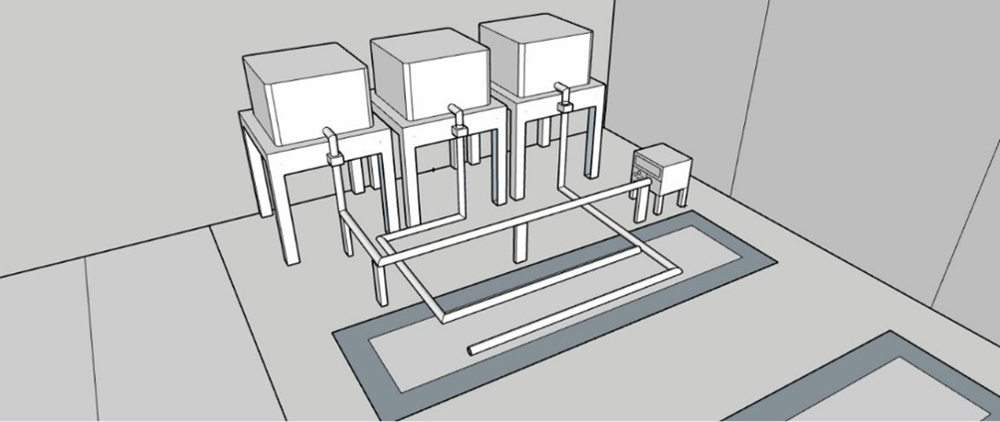
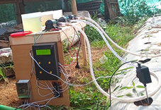
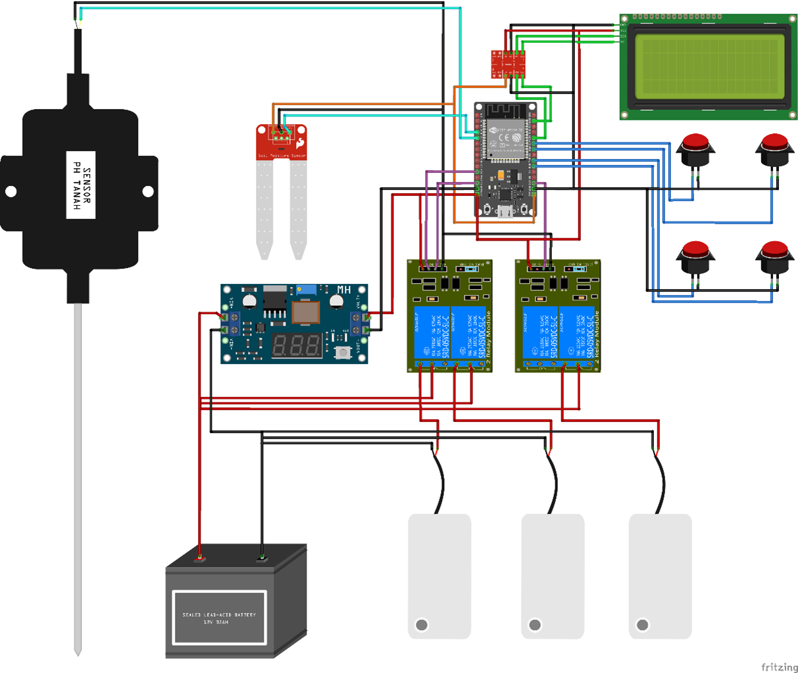
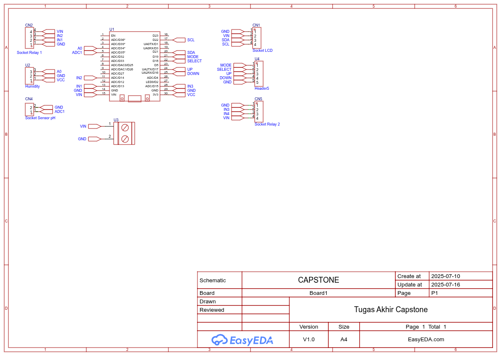
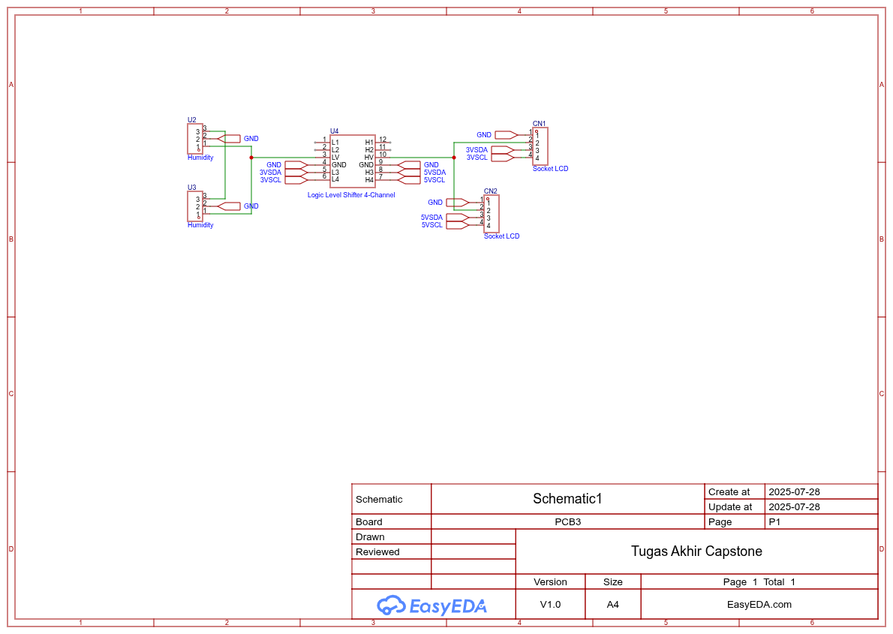
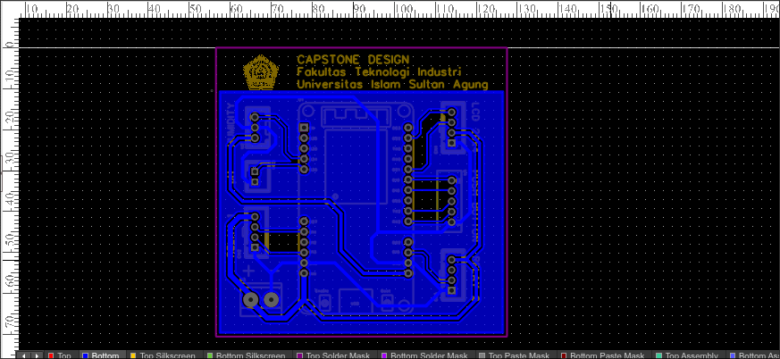
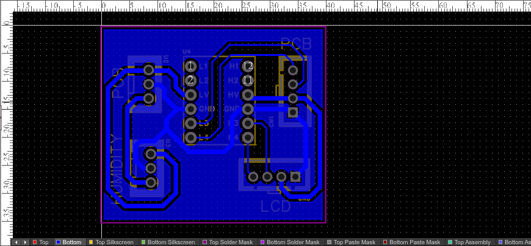
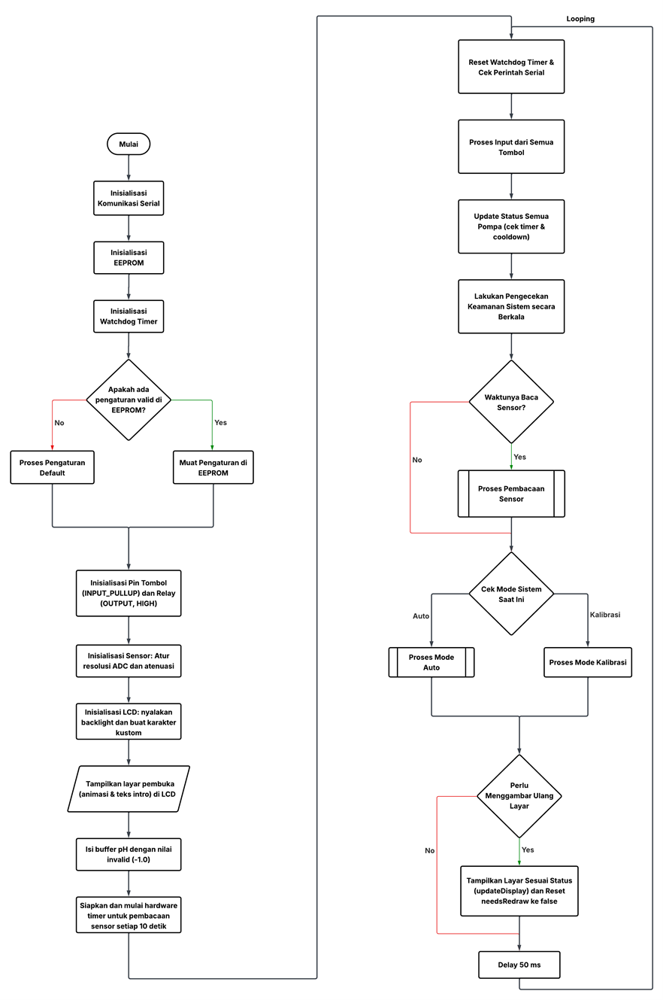

# Prototype Automatic pH Monitoring and Control System for Agriculture


**Final Project - Prototype Automated pH and Humidity System for Agricultural Applications**

---

## About

An ESP32-based automatic pH monitoring and control system designed to optimize soil conditions in agricultural applications. This system can automatically adjust soil pH levels and monitor humidity using 12 VDC pumps for lime and acid solution injection.

### Project Objectives

- Automate soil pH adjustment processes
- Monitor and control soil humidity
- Reduce manual intervention in soil condition maintenance
- Improve efficiency of pH balancing solution usage

---

## System Design & Implementation

### Design Overview

The prototype was carefully designed to ensure optimal performance and ease of maintenance in agricultural field conditions.

<table>
<tr>
<td width="50%" align="center">



</td>
<td width="50%" align="center">



</td>
</tr>
<tr>
<td align="center">

_Figure 1: 3D Design of Solution Tank and Pump System_

</td>
<td align="center">

_Figure 2: Real-world Implementation in Agricultural Field_

</td>
</tr>
</table>

#### Design Features:

- **Modular Tank System**: Three separate containers for lime solution, acid solution, and clean water
- **Elevated Pump Mounting**: Pumps mounted above tanks to prevent backflow and ensure gravity-assisted drainage

---

## Features

### Operating Modes

- **AUTO Mode**: Automatic pH monitoring and control with feedback system
- **CALIBRATION Mode**: Quick 1-point calibration for pH sensor
- **SETTINGS Mode**: System parameter configuration

### Monitoring

- Real-time pH reading with moving average filter
- Soil humidity monitoring
- System and pump status on 20x4 LCD
- Data logging for graphical analysis

### Pump Control

- **Lime Pump**: Increases soil pH
- **Acid Pump**: Decreases soil pH
- **Water Pump**: Automatic circulation and irrigation
- Cooldown protection to prevent overuse
- Total runtime tracking for each pump

### Safety System

- Emergency shutdown at critical pH (< 3.0 or > 9.0)
- Watchdog timer to prevent system hang
- Sensor data validation
- Pump activation conflict protection
- Lockout period after error recovery

---

## Hardware

### Main Components

| Component           | Specification         | Function            |
| ------------------- | --------------------- | ------------------- |
| **Microcontroller** | ESP32 DevKit          | Main controller     |
| **pH Sensor**       | Analog pH Sensor      | Soil pH monitoring  |
| **Humidity Sensor** | Capacitive            | Humidity monitoring |
| **LCD**             | I2C 20x4              | User interface      |
| **Relay Module**    | 3 Channel 5V          | Pump control        |
| **Pumps**           | 3x 12 VDC Pump        | Solution injection  |
| **Power Supply**    | 12V Lead-Acid Battery | Power supply        |

### Pin Configuration

```cpp
// Sensor Pins
#define PH_PIN 35              // ADC1_CH7 for pH sensor
#define HUMIDITY_PIN 34        // ADC1_CH6 for humidity sensor

// Relay Pins (Active LOW)
#define RELAY_LIME_PUMP 13     // Lime solution pump
#define RELAY_ACID_PUMP 14     // Acid solution pump
#define RELAY_WATER_PUMP 15    // Water pump

// Button Pins (Pull-up)
#define BTN_MODE 19            // Mode / Back
#define BTN_SELECT 18          // Select / Confirm
#define BTN_UP 17              // Navigate up / Increment
#define BTN_DOWN 16            // Navigate down / Decrement

// I2C LCD (Default pins)
// SDA: GPIO 21
// SCL: GPIO 22
```

### Circuit Diagram


_Figure 3: Complete System Circuit Diagram_

---

### Schematic


_Figure 4: Schematic Microcontroller_


_Figure 5: Schematic Level Controler_

---

### PCB Project


_Figure 6: PCB Microcontroller_


_Figure 7: PCB Level Converter_

---

## Installation

### Prerequisites

1. **Arduino IDE** (version 1.8.19 or newer)
2. **ESP32 Board Package**
   - Open Arduino IDE → File → Preferences
   - Add the following URL to "Additional Boards Manager URLs":

```
     https://raw.githubusercontent.com/espressif/arduino-esp32/gh-pages/package_esp32_index.json
```

- Tools → Board → Boards Manager → Search "ESP32" → Install

3. **Library Dependencies**

```
   - LiquidCrystal_I2C (by Frank de Brabander)
   - EEPROM (built-in ESP32)
```

### Installation Steps

1. **Clone Repository**

```bash
   git clone https://github.com/MDiaznf23/ph-monitoring-system.git
   cd ph-monitoring-system
```

2. **Open Project**
   - Open `CAPSTONE.ino` file in Arduino IDE
   - Ensure all `.ino` files are in the same folder

3. **Board Configuration**
   - Tools → Board → ESP32 Arduino → ESP32 Dev Module
   - Tools → Port → Select ESP32 COM port

4. **Upload Code**
   - Click Upload button (→)
   - Wait until process completes

5. **Calibrate pH Sensor**
   - Press MODE button until entering CALIBRATION mode
   - Immerse sensor in pH 7.0 buffer solution
   - Wait for stable reading
   - Press SELECT to save calibration

---

## Documentation

### Control Algorithm


_Figure 4: System Control Algorithm Flowchart_

### pH Control Logic

The system uses **hysteresis control** to prevent oscillation:

```
Target pH: 6.4

Dead Band Zone: 6.4 ± 0.6
├─ pH < 5.8  → Activate Lime Pump
├─ pH > 7.0  → Activate Acid Pump
└─ 5.8 ≤ pH ≤ 7.0 → No action
```

**Hysteresis Advantages:**

- Reduces pump switching frequency
- Prevents overshoot
- Saves solution consumption
- Extends pump lifespan

### State Machine

```
[*] --> PUMP_OFF
PUMP_OFF --> PUMP_ON: Activate
PUMP_ON --> PUMP_COOLDOWN: Duration Complete
PUMP_COOLDOWN --> PUMP_OFF: Cooldown Complete
PUMP_ON --> PUMP_ERROR: Safety Violation
PUMP_ERROR --> PUMP_OFF: Manual Reset
```

### File Structure

```
├── CAPSTONE.ino              # Main file and setup
├── READING_PH.ino            # Sensor reading module
├── PH_PUMP.ino               # Pump control module
├── MONITOR_LCD.ino           # LCD interface module
├── HELPER_FUNCTIONS.ino      # Utility functions
├── DIAGNOSTICS.ino           # Data logging
└── README.md                 # This documentation
```

### System Parameters

| Parameter          | Default | Range           | Description                 |
| ------------------ | ------- | --------------- | --------------------------- |
| Target pH          | 6.4     | 4.0 - 10.0      | pH setpoint                 |
| Lime Pump Duration | 5000 ms | 1000 - 30000 ms | Injection duration          |
| Acid Pump Duration | 5000 ms | 1000 - 30000 ms | Injection duration          |
| Lime Cooldown      | 300 s   | 30 - 900 s      | Interval between injections |
| Acid Cooldown      | 300 s   | 30 - 900 s      | Interval between injections |
| Water Cooldown     | 60 s    | 0 - 300 s       | Water pump interval         |
| Min Humidity       | 50%     | -               | Irrigation threshold        |

---

## Usage

### LCD Interface

#### Main Screen (AUTO Mode)

```
AUTO Mode  pH:6.42
Target: 6.4 H:65%
Status: OPTIMAL
Sample [██████████]
```

#### Menu Navigation

- **BTN_MODE**: Change mode / Back
- **BTN_SELECT**: Select / Confirm
- **BTN_UP/DOWN**: Navigate menu / Adjust value

### Settings Menu

1. **pH Target** - Set system target pH
2. **Lime Pump Duration** - Lime solution injection duration
3. **Acid Pump Duration** - Acid solution injection duration
4. **Lime Cooldown** - Interval between lime injections
5. **Acid Cooldown** - Interval between acid injections
6. **Water Cooldown** - Water pump interval
7. **Reset Calibration** - Return to default offset
8. **Reset Defaults** - Reset all settings
9. **Test Pump** - Manual test each pump
10. **Show Runtime** - View total pump runtime
11. **Reset Runtime** - Reset runtime counter

---

## Data Logging

The system sends data to Serial Monitor in CSV format for graphing and analysis:

### pH Data Format

```csv
Timestamp(s), pH, TargetpH, AcidPump, LimePump
1234, 6.42, 6.40, 0, 0
1236, 6.38, 6.40, 0, 0
```

### Humidity Data Format

```csv
Timestamp(s), Humidity(%), WaterPumpStatus
1234, 65.2, 0
1236, 64.8, 0
```

### Data Visualization

Data can be visualized using tools such as:

- **Serial Plotter** Arduino IDE
- **Python** (matplotlib, pandas)
- **Excel / Google Sheets**

---

## Safety System

### Emergency Shutdown

System will perform emergency shutdown if:

- pH < 3.0 (Too Acidic)
- pH > 9.0 (Too Alkaline)
- Sensor error or unreadable
- Pump stuck ON > 35 seconds

### Recovery Procedure

1. System enters **PUMP_ERROR** state
2. LCD displays "SYSTEM ERROR"
3. Press SELECT to reset error
4. System enters **LOCKOUT** for 5 minutes
5. After lockout completes, system returns to normal

### Watchdog Timer

- Timeout: 15 seconds
- Automatic reset if system hangs
- Prevents deadlock

---

## Calibration

### Quick 1-Point Calibration

1. Prepare pH 7.0 buffer solution
2. Enter CALIBRATION mode
3. Immerse sensor until reading stabilizes
4. Press SELECT to save
5. System will calculate new offset

**Calibration Formula:**

```cpp
pH = (-0.0139 × rawValue) + calibrationOffset
calibrationOffset = 7.0 + (0.0139 × rawValue)
```

### Calibration Tips

- Clean sensor before calibration
- Use fresh buffer solution
- Avoid cross-contamination
- Re-calibrate every 2-4 weeks

---

## Troubleshooting

### Debug Mode

To enable detailed logging:

```cpp
#define ACTIVE_LOG_LEVEL LOG_LEVEL_DEBUG
```

Logging levels:

- `LOG_LEVEL_NONE` - No logs
- `LOG_LEVEL_ERROR` - Critical errors only
- `LOG_LEVEL_INFO` - Important information (default)
- `LOG_LEVEL_DEBUG` - All details including sensor data

---

## Future Development

- [ ] WiFi connectivity for remote monitoring
- [ ] Real-time web dashboard
- [ ] Database logging (InfluxDB)
- [ ] Mobile app (Android/iOS)
- [ ] Machine learning for pH prediction
- [ ] Multi-zone control
- [ ] Battery level monitoring
- [ ] SMS/Email notification

---

## License

This project is created for academic Final Project purposes.

---

## Contact

For questions or suggestions, please contact:

- Email: mdiaznurfar23@std.unissula.ac.id
- GitHub: [@mdiaznf23](https://github.com/MDiaznf23)

---
